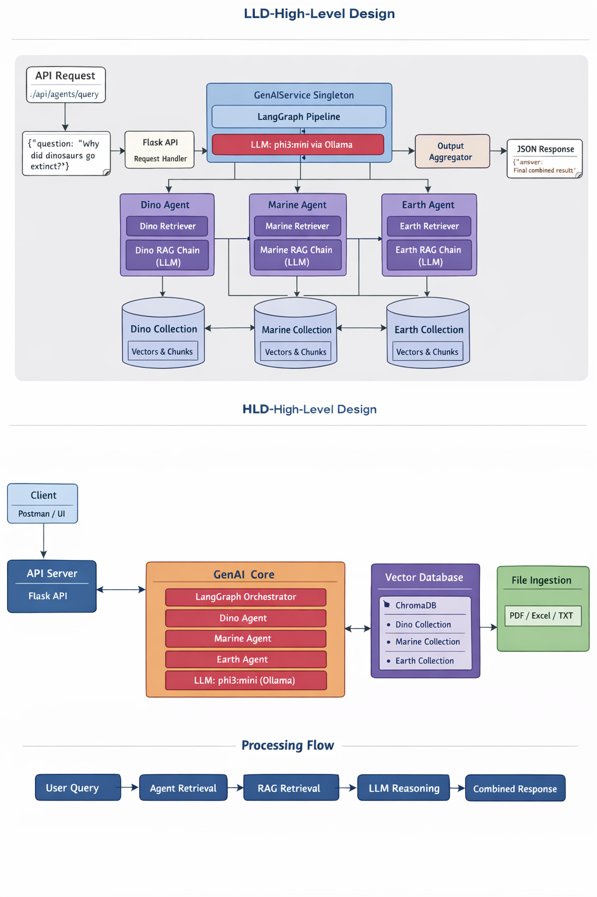

# 🧠 Dynasore – Multi-Agent GenAI RAG System

A production-ready **Multi-Agent Retrieval-Augmented Generation (RAG)** system built using **LangGraph, ChromaDB, and FastAPI**, designed to answer domain-specific queries through specialized agents while sharing a common LLM backbone.

---

## ✨ Key Features

- 🧠 Multi-agent reasoning (Dino, Marine, Earth)
- 📚 Domain-specific RAG using ChromaDB
- 🔗 LangGraph-based agent orchestration
- ⚡ FastAPI backend
- 📄 PDF / Excel / TXT ingestion
- 🐳 Docker & Docker Compose support
- 🧩 Modular, extensible architecture

---

## 🏗️ Architecture Design (HLD & LLD)

This project follows a **layered, modular, and scalable architecture** designed for real-world GenAI applications using **Multi-Agent RAG** principles.


---

## ⚙️ Configuration

```python
LLM_MODEL = "phi3:mini"
VECTOR_DB_DIR = "chroma_db"
CHUNK_SIZE = 500
CHUNK_OVERLAP = 50
```

---

## 🧪 Local Setup

### 1️⃣ Create Virtual Environment

```bash
python -m venv venv
```

Activate it:

```bash
# Linux / macOS
source venv/bin/activate

# Windows
venv\Scripts\activate
```

---

### 2️⃣ Install Dependencies

```bash
pip install -r requirements.txt
```

---

### 3️⃣ Run the Application

```bash
python -m src.api.app
```

Server will start at:

```
http://localhost:5000
```

---

## 🔌 API Endpoints

### 🧠 Agent Query

**POST** `/api/agents/query`

```json
{
  "question": "Explain coral reefs",
  "agent": "marine"
}
```

**Available Agents**

- dino
- marine
- earth
- all – executes all agents sequentially

---

### 📚 RAG-Only Query

**POST** `/api/rag/query`

```json
{
  "question": "Why did dinosaurs go extinct?"
}
```

---

## 🧬 Multi-Agent Execution Flow

```
User Query
    ↓
Dino Agent
    ↓
Marine Agent
    ↓
Earth Agent
    ↓
Unified Response
```

### Architecture Notes

- Each agent maintains its own ChromaDB collection
- All agents share a single LLM
- Agents execute independently and sequentially
- Responses are aggregated into a final answer

---

## 📥 Data Ingestion Pipeline

### Supported Formats

- PDF
- XLSX
- TXT

### Example Structure

```
data/
├── marine_life.pdf
├── ocean_species.xlsx
```

### Ingestion Workflow

- Files loaded at application startup
- Text chunking with overlap
- Embeddings generated
- Stored in agent-specific ChromaDB collections

---

## 🐳 Docker Support

### Dockerfile

```dockerfile
FROM python:3.11-slim

WORKDIR /app

COPY requirements.txt .
RUN pip install --no-cache-dir -r requirements.txt

COPY . .

EXPOSE 5000

CMD ["python", "-m", "src.api.app"]
```

---

### Docker Compose

```yaml
version: "3.9"

services:
  genai:
    build: .
    ports:
      - "5000:5000"
    volumes:
      - ./chroma_db:/app/chroma_db
    restart: always
```

---

## 🧯 Common Issues & Fixes

### ❌ Ollama Memory Error

Model requires more system memory

**Fix**
- Use phi3:mini
- Close heavy applications
- Reduce chunk size

---

### ❌ Slow First Response

**Reason**
- Initial embedding generation

**Fix**
- Wait for first execution
- Subsequent requests are fast

---

### ❌ Module Import Errors

Always start the app using:

```bash
python -m src.api.app
```

---

## 🚀 Roadmap

- JWT-based authentication
- Streaming responses
- User-level memory
- Cloud deployment (AWS / Azure)
- React frontend

---

## 👨‍💻 Author

**Nishant Mane**  
GenAI Engineer | RAG | LangGraph | Full-Stack Developer

---

## ⭐ Support

If you find this project useful:

- Star the repository
- Report issues
- Suggest enhancements
